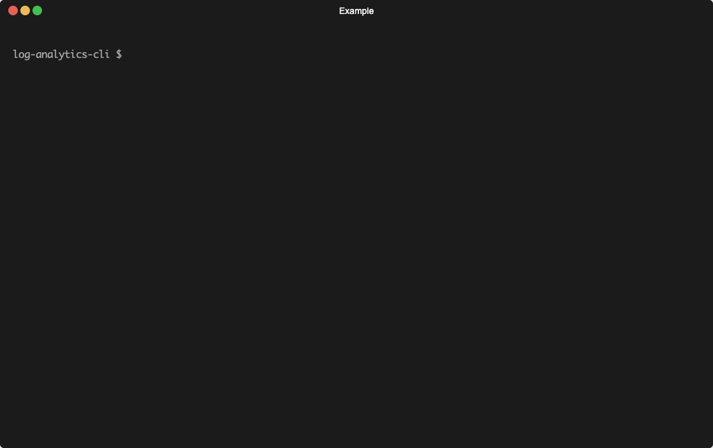

이벤트 로그를 수집→적재→분석/집계까지 엔드투엔드로 다루는 개발용 로그 데이터 레이크 구성입니다. `log-ingest`로 이벤트를 받아 CloudWatch Logs → (구독 필터) → Firehose로 전달하고, `log-pipeline-infra`로 배포한 인프라(CDK: S3/Firehose/로그 변환용 Lambda/Glue Catalog)를 배포를 통해 S3에 적재하, `log-analytics-cli`로 Athena에서 테이블·파티션 생성과 CTAS/INSERT 기반 정제·집계를 수행합니다.

## [로그 수집 (log-ingest)](./log-ingest/README.md)

  

클라이언트/서버 이벤트를 API Gateway·Lambda 또는 SQS·Lambda로 수집하고, CloudWatch Logs 구독 필터를 통해 Firehose로 전달합니다.

- [Serverless Framework](https://www.serverless.com/framework/docs)
- [AWS API Gateway](https://aws.amazon.com/ko/api-gateway/)
- [AWS SQS](https://aws.amazon.com/ko/sqs/)
- [AWS Lambda](https://aws.amazon.com/ko/lambda/)
- [AWS CloudWatch Logs·Subscription Filter](https://aws.amazon.com/ko/cloudwatch/)

## [로그 적재 (log-pipeline-infra)](./log-pipeline-infra/README.md)

  

CDK로 S3 버킷, Firehose, Lambda (로그 변환용), Glue Catalog를 배포합니다. Firehose는 GZIP 해제 → 로그 추출 → Lambda 변환 후 S3 버킷의 `bronze/`에 적재합니다.

- [AWS CDK](https://docs.aws.amazon.com/ko_kr/cdk/v2/guide/home.html)
- [AWS Kinesis Firehose](https://aws.amazon.com/ko/firehose/)
- [AWS Lambda](https://aws.amazon.com/ko/lambda/)
- [AWS S3](https://aws.amazon.com/ko/s3/)
- [AWS Glue](https://aws.amazon.com/ko/glue/)

## [로그 분석/집계 (log-analytics-cli)](./log-analytics-cli/README.md)

  

Athena에서 테이블/파티션을 생성하고 CTAS/INSERT로 정제·집계를 실행하며, 레이어(bronze/silver/gold)·테이블 단위로 작업을 관리합니다.

- [@aws-sdk/client-athena](https://www.npmjs.com/package/@aws-sdk/client-athena)
- [commander](https://www.npmjs.com/package/commander)
- [chalk](https://www.npmjs.com/package/chalk)
- [ora](https://www.npmjs.com/package/ora)
- [cli-spinner](https://www.npmjs.com/package/cli-spinner)
- [log-update](https://www.npmjs.com/package/log-update)
- [zod](https://www.npmjs.com/package/zod)
